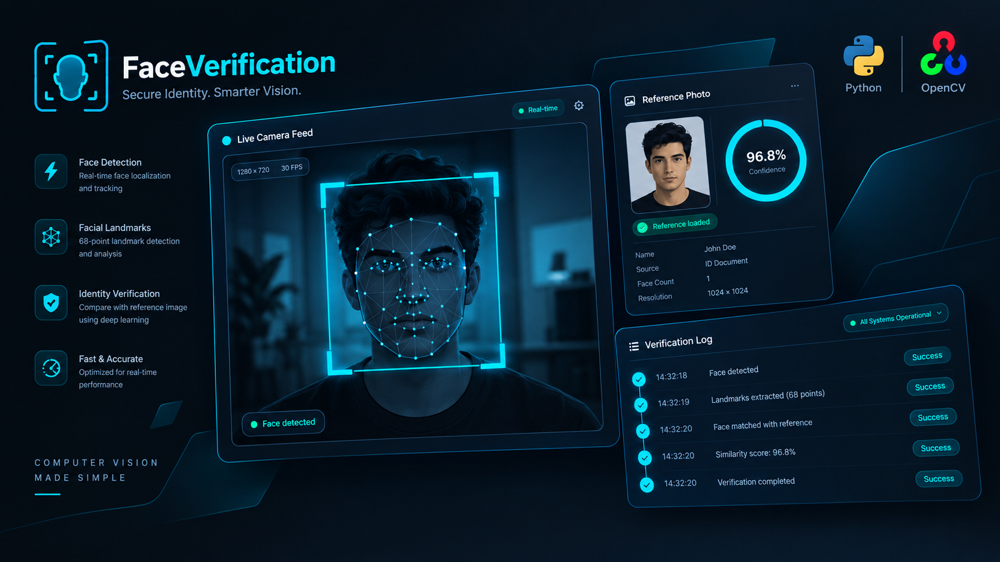
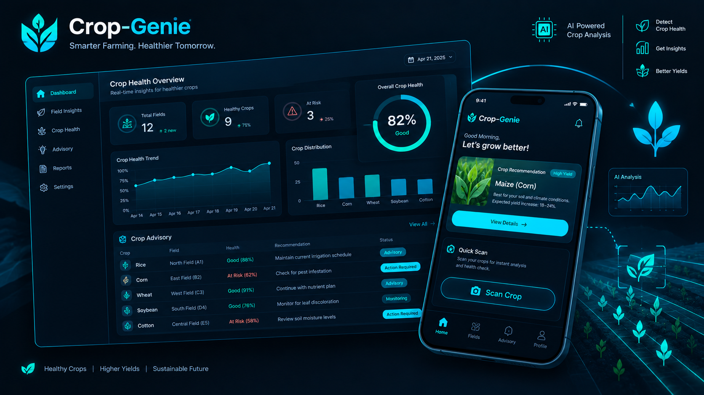
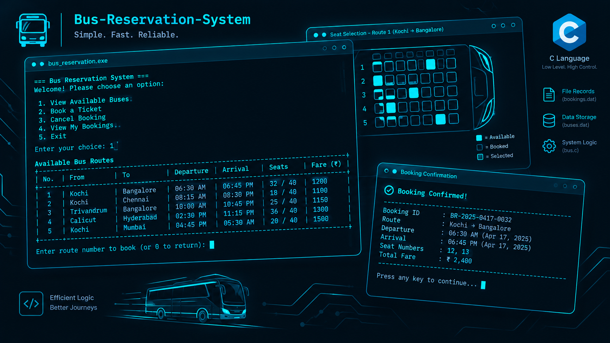

<!-- ═══════════════════════════════════════════════════════════════
     HEADER BANNER
     ═══════════════════════════════════════════════════════════ -->
<p align="center">
  
</p>

<!-- ═══════════════ TYPING ANIMATION ═══════════════ -->
<p align="center">
  <a href="https://github.com/TechieTojin">
    
  </a>
</p>

<!-- ═══════════════ OPEN TO WORK + PROFILE BADGES ═══════════════ -->
<p align="center">
  
</p>

<p align="center">
  

  <a href="https://github.com/TechieTojin?tab=repositories">
    
  </a>

  
</p>


<br/>

<!-- ═══════════════════════════════════════════════════════════════
     ABOUT ME
     ═══════════════════════════════════════════════════════════ -->
<h2 align="center">👋 About Me</h2>

<table>
<tr>
<td width="58%" valign="top">

Most people learn to code to pass. I learned to code because I wanted to
see something I made **get used**. That's still the whole thing.

I'm an **Associate Software Engineer at Simplify3x**, where I converted from
intern to full-time. Day to day I'm across **web and mobile** — shipping
features in React and React Native, writing TypeScript the next person can
actually read, building and integrating REST APIs on Node.js, and cleaning
up code I inherited.

> **The lesson that stuck:** making code work is the easy half.
> Making it maintainable is the job.

**Two things shaped how I build:**

🎲 &nbsp;**Statistics.** A BSc in Statistics & Computer Science, then an MCA at
Christ University. That maths background pushed me into AI early — two
peer-reviewed papers on deepfake and fake-news detection. So when I wire up
an LLM integration or an NLP pipeline, I know what's happening *under* the
API call.

⚡ &nbsp;**Hackathons.** Five of them. Three first-place finishes, one second, one
national top-100. Thirty-six hours, a cold start, a working demo at the end —
repeatedly, under pressure, with a team. That's where I learned to scope
ruthlessly and ship anyway.

</td>
<td width="42%" valign="top">

**🎯 What I'm good at**

`→` &nbsp;Full-stack delivery — React, React Native, TypeScript, Node.js, Express, REST APIs

`→` &nbsp;AI/ML that isn't just an API key — NLP, generative AI, deep learning, computer vision

`→` &nbsp;Shipping under real constraints, not ideal ones

`→` &nbsp;The unglamorous team stuff — code review, reusable component libraries, docs that survive me

<br/>

**🔭 What I'm looking for**

SDE roles where the product ships to **real users** and the AI layer is more than a demo.

If you're hiring for that, or building toward it — **reach out. I reply to every message.**

</td>
</tr>
</table>

<br/>

<!-- ═══════════════════════════════════════════════════════════════
     WHO I AM — TYPESCRIPT OBJECT
     ═══════════════════════════════════════════════════════════ -->
<h2 align="center">🧑‍💻 Who I Am</h2>

```typescript
const tojin = {
  name:     "Tojin Varkey Simson",
  title:    "Associate Software Engineer @ Simplify3x Software Pvt Ltd",
  location: "Bengaluru, Karnataka, India",

  topSkills: ["REST APIs", "Generative AI", "Natural Language Processing"],

  stack: {
    languages:  ["Python", "JavaScript", "TypeScript", "C", "HTML", "CSS"],
    frontend:   ["React", "React Native", "Expo"],
    backend:    ["Node.js", "Express.js", "REST APIs", "Mongoose"],
    databases:  ["MySQL", "MongoDB", "Firebase"],
    aiml:       ["OpenCV", "DeepFace", "Deep Learning", "NLP", "Generative AI"],
    devtools:   ["Git", "GitHub", "Docker", "Postman", "VS Code", "EAS", "FCM"]
  },

  education: [
    { degree: "MCA, Computer Science",             school: "Christ University, Bangalore", years: "2024 – 2026" },
    { degree: "BSc Statistics & Computer Science", school: "St. Joseph's University",       years: "2021 – 2024" }
  ],

  launchedProjects: [
    { name: "FaceVerification",       lang: "Python",     about: "Real-time face recognition & verification — OpenCV + DeepFace" },
    { name: "Crop-Genie",             lang: "TypeScript", about: "AI-powered solution supporting smallholder farmers" },
    { name: "Bus-Reservation-System", lang: "C",          about: "End-to-end bus ticket booking & reservation management" }
  ],

  publications: 2,
  hackathons:   { entered: 5, firstPlace: 3, secondPlace: 1, nationalTop100: 1 },

  currentlyShipping: "A vertically integrated grocery retail platform — one Express/MongoDB " +
                     "API and one stock ledger behind 4 surfaces: React admin dashboard, " +
                     "in-store POS, customer React Native app, driver app",

  status: "Converted intern → full-time. Building across the B2C storefront and in-store tooling.",

  openTo: ["SDE / Full-Stack roles", "AI-first product teams", "Open source collaboration"]
};
```

<br/>


<!-- ═══════════════════════════════════════════════════════════════
     CURRENT WORK
     ═══════════════════════════════════════════════════════════ -->
<h2 align="center">💼 What I'm Building at Simplify3x</h2>

<p align="center">
  
  
</p>

A **vertically integrated grocery retail platform** — one Express/MongoDB API and one
stock ledger behind **four deployed surfaces**: a React admin dashboard, an in-store POS
terminal, a customer React Native app, and a driver app. I build across both sides of the
business: the B2C storefront customers order from, and the outlet and POS tooling shop
owners and staff run the business on.

<details>
<summary><b>🔍 &nbsp;Expand — selected engineering work</b></summary>

<br/>

| | Contribution |
| :-: | :--- |
| 🔐 | **Prefix blind-index search** — POS staff find a customer by partial phone number while numbers stay **encrypted at rest**. Keyed HMAC digests of every 4-to-10-digit prefix, one indexed equality lookup, nothing decrypted — with a race-safe backfill and search-as-you-type lookup in the POS UI. |
| 🧭 | **Customer-facing API surface** — OTP authentication, profiles, catalogue services, push-token management, favourites, reorder eligibility, product-detail enrichment and order projections — response shapes designed so **older and newer app builds both read them** without a coordinated release. |
| 🔎 | **Smart catalogue search API** — fuzzy matching, autocomplete, trending terms and analytics, hardened with a **PII filter and frequency gate** so customer-typed strings never surfaced in a public trending list. |
| 🔁 | **Returns & exchanges** — exchange endpoints, wallet-ledger refunds, quality-check escalation and twelve new status transitions, a guided customer wizard with evidence upload, **Razorpay** price-difference payment, and admin console actions. |
| 🛡️ | **Auth & API layer** — single-flight token refresh with one authorised retry on 401, session-generation guards preventing cross-session data leaks, and push-token hardening that aborts in-flight registration on logout. |
| 📲 | **Native FCM push across both mobile apps** with SNS endpoint reconciliation — and unblocked iOS releases: EAS build profiles, APNs, a TestFlight profile, and a Hermes-engine checkout crash fix. |

</details>

<br/>


<!-- ═══════════════════════════════════════════════════════════════
     FEATURED PROJECTS
     ═══════════════════════════════════════════════════════════ -->
<h2 align="center">🚀 Featured Projects</h2>

<!-- ─────────── PROJECT 1 ─────────── -->
<h3 align="center">🧠 &nbsp;FaceVerification</h3>

<p align="center">
  <a href="https://github.com/TechieTojin/FaceVerification">
    
  </a>
</p>

<p align="center">
  
  
  
  
</p>

> **A Python-based face recognition system that uses OpenCV for real-time video capture
> and DeepFace to compare a live camera feed against a reference image.** Real-time
> verification feedback — the computer-vision groundwork behind my published deepfake research.

<table>
<tr>
<td width="50%" valign="top">

**✨ &nbsp;Highlights**

`→` &nbsp;Live webcam capture with frame-by-frame face detection

`→` &nbsp;Embedding-based identity matching, not pixel comparison

`→` &nbsp;Instant verified / not-verified feedback on the video stream

`→` &nbsp;Swappable DeepFace backends for accuracy-vs-speed tuning

</td>
<td width="50%" valign="top">

**🧱 &nbsp;Architecture**

| Layer | Technology |
| :--- | :--- |
| Language | Python |
| Vision | OpenCV |
| Recognition | DeepFace |
| Domain | Deep Learning · AI/ML |
| Tooling | Git · VS Code |

</td>
</tr>
</table>

<p align="center">
  <a href="https://github.com/TechieTojin/FaceVerification">
    
  </a>
  
</p>

<br/>


<!-- ─────────── PROJECT 2 ─────────── -->
<h3 align="center">🌾 &nbsp;Crop-Genie</h3>

<p align="center">
  <a href="https://github.com/TechieTojin/Crop-Genie">
    
  </a>
</p>

<p align="center">
  
  
  
  
</p>

> **Crop Genie — AI solutions for smallholder farmers.**
> Practical machine intelligence for users who don't have a data team: crop-level
> guidance surfaced through a clean, low-friction TypeScript interface.

<table>
<tr>
<td width="50%" valign="top">

**✨ &nbsp;Highlights**

`→` &nbsp;AI-driven crop guidance aimed at low-resource farms

`→` &nbsp;Typed end-to-end — TypeScript from UI down to the API layer

`→` &nbsp;Designed for low-friction use on modest hardware and networks

`→` &nbsp;Component-driven React front end over a REST backend

</td>
<td width="50%" valign="top">

**🧱 &nbsp;Architecture**

| Layer | Technology |
| :--- | :--- |
| Language | TypeScript |
| Frontend | React · HTML · CSS |
| Backend | Node.js · Express · REST |
| Intelligence | AI/ML · NLP |
| Tooling | Git · Postman · VS Code |

</td>
</tr>
</table>

<p align="center">
  <a href="https://github.com/TechieTojin/Crop-Genie">
    
  </a>
  
</p>

<br/>


<!-- ─────────── PROJECT 3 ─────────── -->
<h3 align="center">🚌 &nbsp;Bus-Reservation-System</h3>

<p align="center">
  <a href="https://github.com/TechieTojin/Bus-Reservation-System">
    
  </a>
</p>

<p align="center">
  
  
  
  
</p>

> **A comprehensive platform for managing bus services efficiently** — view available
> buses, book tickets, cancel reservations and check booking status. Written in C: the
> project where I learned how much of "simple CRUD" is actually state and edge cases.

<table>
<tr>
<td width="50%" valign="top">

**✨ &nbsp;Highlights**

`→` &nbsp;Full booking lifecycle — search, reserve, cancel, verify

`→` &nbsp;Seat inventory kept consistent across every operation

`→` &nbsp;File-backed persistence with no database dependency

`→` &nbsp;Manual memory and state handling, no framework safety net

</td>
<td width="50%" valign="top">

**🧱 &nbsp;Architecture**

| Layer | Technology |
| :--- | :--- |
| Language | C |
| Interface | Console menu system |
| Core | Booking · Cancellation · Status |
| Data | File persistence · Structs |
| Tooling | Git · GitHub · VS Code |

</td>
</tr>
</table>

<p align="center">
  <a href="https://github.com/TechieTojin/Bus-Reservation-System">
    
  </a>
  
</p>

<br/>

<h3 align="center">📦 More From My 41 Repositories</h3>

<div align="center">

| Project | What it does | Stack |
| :--- | :--- | :--- |
| [**College-System**](https://github.com/TechieTojin/-College-System-) | Web app managing college operations — student registration, course management and grade tracking | HTML · CSS · JS |
| [**LibraryManagementSystem**](https://github.com/TechieTojin/LibraryManagementSytem) | Automates library operations — user registration, login, book search and account management | HTML · CSS · JS |
| [**Soccer-Game**](https://github.com/TechieTojin/-Soccer-Game) | A modern immersive AR/VR soccer experience | Python |

</div>

<p align="center">
  <a href="https://github.com/TechieTojin?tab=repositories">
    
  </a>
</p>

<br/>


<!-- ═══════════════════════════════════════════════════════════════
     TECH STACK
     ═══════════════════════════════════════════════════════════ -->
<h2 align="center">🛠️ Tech Stack</h2>

<p align="center"><b>⌨️ &nbsp;Languages</b></p>
<p align="center">
  <a href="https://skillicons.dev">
    
  </a>
</p>

<p align="center"><b>🎨 &nbsp;Frontend &amp; Mobile</b><br/><sub>React · React Native · Expo · TypeScript</sub></p>
<p align="center">
  <a href="https://skillicons.dev">
    
  </a>
</p>

<p align="center"><b>⚙️ &nbsp;Backend &amp; Infra</b><br/><sub>Node.js · Express.js · REST APIs · Mongoose · Docker</sub></p>
<p align="center">
  <a href="https://skillicons.dev">
    
  </a>
</p>

<p align="center"><b>☁️ &nbsp;Cloud &amp; Services</b><br/><sub>Firebase · FCM · AWS SNS · Razorpay · EAS Build</sub></p>
<p align="center">
  <a href="https://skillicons.dev">
    
  </a>
</p>

<p align="center"><b>🧠 &nbsp;AI/ML &amp; Databases</b><br/><sub>OpenCV · DeepFace · Deep Learning · NLP · Generative AI · MySQL · MongoDB</sub></p>
<p align="center">
  <a href="https://skillicons.dev">
    
  </a>
</p>

<p align="center"><b>🧰 &nbsp;Dev Tools</b></p>
<p align="center">
  <a href="https://skillicons.dev">
    
  </a>
</p>

<br/>


<!-- ═══════════════════════════════════════════════════════════════
     PUBLICATIONS
     ═══════════════════════════════════════════════════════════ -->
<h2 align="center">📄 Publications</h2>

<p align="center">
  
  
</p>

<div align="center">

| 📚 Paper | Focus |
| :--- | :--- |
| **A Study on Analysis of Deep Learning Approaches for Detecting Fake News, Audio & Video** | Comparative analysis of deep learning methods across text, audio and video misinformation |
| **Automated Detection of Deepfakes Using Integrated AI and Computer Vision Strategies** | Combining AI models with computer vision pipelines for automated deepfake detection |

</div>

<br/>

<!-- ═══════════════════════════════════════════════════════════════
     ACHIEVEMENTS
     ═══════════════════════════════════════════════════════════ -->
<h2 align="center">🏅 Hackathons &amp; Honors</h2>

<p align="center">
  
  
  
</p>
<p align="center">
  
  
</p>

<p align="center">
  <sub><i>5 hackathons · 3 first places · 1 second place · 1 national top-100</i></sub>
</p>

<br/>

<!-- ═══════════════════════════════════════════════════════════════
     EDUCATION
     ═══════════════════════════════════════════════════════════ -->
<h2 align="center">🎓 Education</h2>

<div align="center">

| Degree | Institution | Years |
| :--- | :--- | :--- |
| 🎓 **Master of Computer Applications** — Computer Science | Christ University, Bangalore | June 2024 – May 2026 |
| 📊 **BSc Statistics & Computer Science** | St. Joseph's University | July 2021 – May 2024 |

</div>

<br/>


<!-- ═══════════════════════════════════════════════════════════════
     GITHUB STATS
     ═══════════════════════════════════════════════════════════ -->
<h2 align="center">📊 GitHub Stats</h2>

<p align="center">
  <a href="https://github.com/TechieTojin?tab=repositories">
    
  </a>
  <a href="https://github.com/TechieTojin?tab=followers">
    
  </a>
  <a href="https://github.com/TechieTojin?tab=stars">
    
  </a>
</p>

<p align="center">
  
  
  
</p>

<p align="center">
  
</p>

<p align="center">
  
  
  
  
</p>

<!-- ═══════════════ CONTRIBUTION CALENDAR ═══════════════ -->
<h3 align="center">🐍 Contribution Graph</h3>

<p align="center">
  
</p>

<!-- ═══════════════ STREAK STATS ═══════════════ -->
<h3 align="center">⚡ Coding Streak</h3>

<p align="center">
  <a href="https://github.com/TechieTojin">
    
  </a>
</p>
<br/>


<!-- ═══════════════════════════════════════════════════════════════
     CONNECT
     ═══════════════════════════════════════════════════════════ -->
<h2 align="center">🤝 Connect With Me</h2>

<p align="center">
  <i>I reply to every message.</i>
</p>

<p align="center">
  <a href="https://www.linkedin.com/in/tojin-varkeysimson-664650286">
    
  </a>
  <a href="mailto:tojinsimson28@gmail.com">
    
  </a>
  <a href="https://github.com/TechieTojin">
    
  </a>
</p>

<br/>

<p align="center">
  
</p>

<!-- ═══════════════ FOOTER BANNER ═══════════════ -->
<p align="center">
  
</p>
