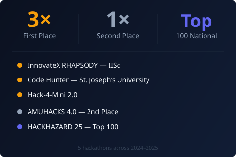

<!-- TOJIN VARKEY SIMSON — ENGINEERING PORTFOLIO -->

  

  &nbsp;
  &nbsp;
  

Software Engineer at **Simplify3x Software**, Bengaluru. I build production web and mobile products end-to-end — from API contracts through client interfaces to release. Background in statistics and computer science, with published research in deepfake detection and three first-place hackathon finishes.

---

### Flagship Project

  

**Atlas** — A local-first AI research platform. Multi-agent orchestration that plans, gathers evidence, validates citations, synthesises findings, and persists results as a navigable knowledge graph. Runs offline, survives cancellation mid-run, and compares research across sessions.

---

### Projects

  

**Crop-Genie** — AI crop advisory for smallholder farmers on modest hardware and unreliable networks.
 React Native · Expo · TypeScript · Python · Scikit-learn — <a href="https://github.com/TechieTojin/Crop-Genie">Repository →</a>

 

  

**Face Verification** — Real-time webcam identity verification with embedding-based matching and swappable backends.
 Python · OpenCV · DeepFace — <a href="https://github.com/TechieTojin/FaceVerification">Repository →</a>

 

  

**Bus Reservation System** — Full booking lifecycle in C with file-backed persistence and seat inventory consistency.
 C · File I/O · Data Structures — <a href="https://github.com/TechieTojin/Bus-Reservation-System">Repository →</a>

<b>More projects</b>

 

**Campus Rush** — Multi-interface campus ordering platform.
 React Native · React · Node.js · Express · MongoDB · Redux

**Soccer AR/VR** — Football simulation across 2D, 3D, AR, and VR.
 Python · Pygame · OpenGL · OpenCV · NumPy

**FinTech Advisory** — Transaction advisory system with analytics.
 Flask · SQL · Pandas

**Journey Uplift** — Typed analytics interface with simulated data.
 React · React Query · Tailwind · shadcn/ui

**Finance Portal** — Financial analytics portal (2nd place, AMUHACKS 4.0).
 React · SQL

<a href="https://github.com/TechieTojin?tab=repositories">Browse all repositories →</a>

---

### Experience

**Simplify3x Software Pvt. Ltd.** — Bengaluru
 Software Engineer · Jul 2026 → Present · *Intern · Feb–Jun 2026*

- Built catalog, cart, order placement, and delivery timelines across a B2B retail platform in React Native and TypeScript
- Designed REST API contracts and resolved client/server state synchronisation issues
- Investigated production defects through structured logging and systematic reproduction
- Contributed to an AI-assisted test automation platform with execution tracking
- Developed reusable shared components; participated in cross-team code review

---

### Toolkit

<table>
<tr><td>

**Client**&nbsp;&nbsp;

</td></tr>
<tr><td>

**Service**&nbsp;&nbsp;

</td></tr>
<tr><td>

**Data**&nbsp;&nbsp;

</td></tr>
<tr><td>

**AI/ML**&nbsp;&nbsp;

</td></tr>
<tr><td>

**Languages**&nbsp;&nbsp;TypeScript · JavaScript · Python · SQL · Java · C

**Tools**&nbsp;&nbsp;Git · GitHub · Docker · Postman · VS Code · EAS Build

</td></tr>
</table>

---

### Achievements

  

---

### Publications

**A Study on Analysis of Deep Learning Approaches for Detecting Fake News, Audio & Video**
 Comparative analysis of deep learning methods across text, audio, and video misinformation.

**Automated Detection of Deepfakes Using Integrated AI and Computer Vision Strategies**
 Combining AI models with computer vision pipelines for automated deepfake detection.

### Education

**Master of Computer Applications** — Christ University, Bangalore (2024–2026) · 8.2 CGPA
 **B.Sc. Statistics & Computer Science** — St. Joseph's University (2021–2024) · 7.5 CGPA

**Student Coordinator** — Smart India Hackathon 2025. Coordinated across five university campuses.

---

  

  

---

  &nbsp;
  &nbsp;
  

Bengaluru, India

