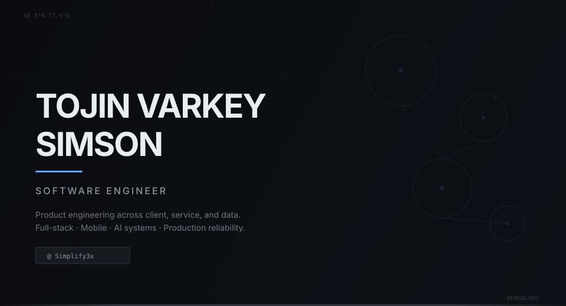
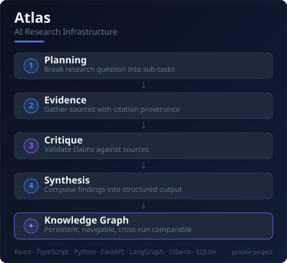
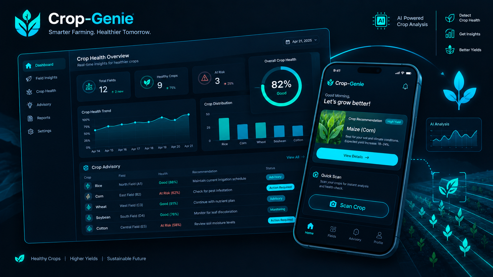
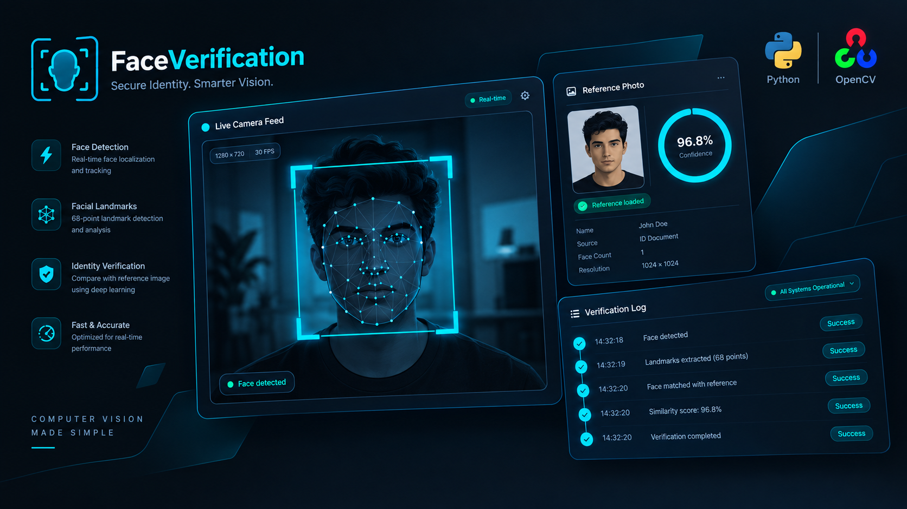
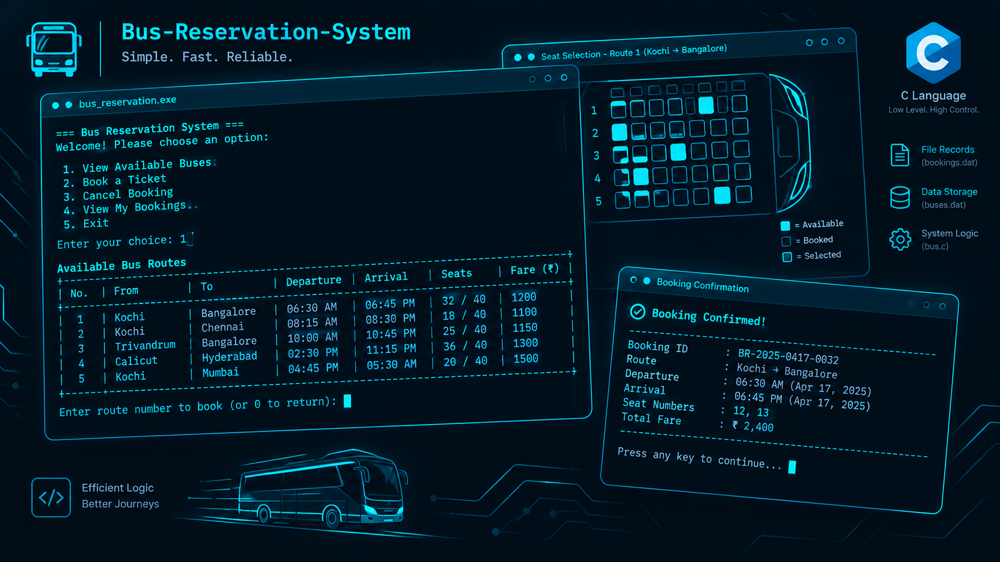
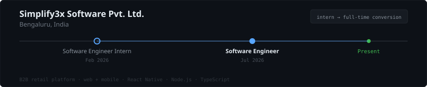
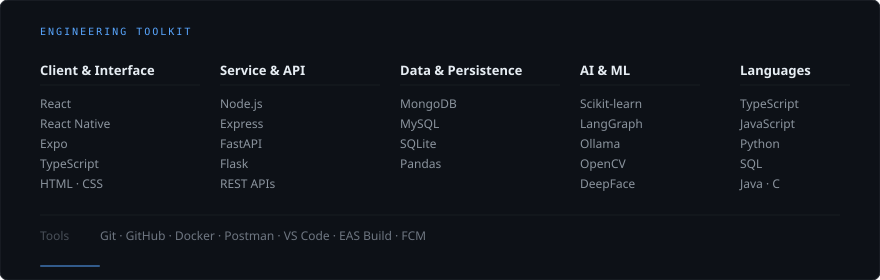

<!-- TOJIN VARKEY SIMSON — ENGINEERING PORTFOLIO -->

<p align="center">
  
</p>

<p align="center">
  <a href="https://github.com/TechieTojin">GitHub</a>&nbsp;&nbsp;·&nbsp;&nbsp;<a href="https://www.linkedin.com/in/tojin-varkey-simson">LinkedIn</a>&nbsp;&nbsp;·&nbsp;&nbsp;<a href="mailto:tojinsimson28@gmail.com">Email</a>
</p>

<br/>

Software Engineer at **Simplify3x Software** in Bengaluru. I build production web and mobile products — TypeScript and React Native on the client, Node.js and Express on the service layer, MongoDB and MySQL underneath. Features go from specification through API contract design, implementation, testing, and release. When something breaks, I debug to root cause.

Background in statistics (B.Sc.) and computer science (MCA). Two peer-reviewed papers on deepfake and misinformation detection. Three first-place hackathon finishes across five competitions. I build tools outside of work — most recently, a local-first AI research platform with multi-agent orchestration and knowledge graph generation.

<br/>

---

<br/>

<p align="center"><sub>01</sub></p>

### Selected Work

<br/>

<p align="center">
  
</p>

<br/>

**Atlas** is the system I built because existing research tools either lose state when they fail, can't trace a claim back to its source, or require a cloud connection to function.

It runs locally. Each research session moves through planning, evidence gathering, critique, and synthesis — orchestrated by cooperating agents that can be cancelled mid-run and restarted without data loss. Every generated claim is traced back to its source with deterministic validation. Completed research persists as a navigable knowledge graph with project-scoped semantic memory, and runs can be compared side by side.

<br/>



**Crop-Genie** — Cross-platform agricultural decision-support for smallholder farmers. AI-driven crop guidance designed for modest hardware and unreliable networks. Typed end-to-end in TypeScript with a React Native/Expo client and Python/Scikit-learn intelligence layer.

<a href="https://github.com/TechieTojin/Crop-Genie">Repository →</a>

<br/>

<table>
<tr>
<td width="50%" valign="top">



**Face Verification** — Real-time webcam identity verification using embedding-based matching, not pixel comparison. Swappable DeepFace backends for accuracy-vs-speed tuning.

Python · OpenCV · DeepFace

<a href="https://github.com/TechieTojin/FaceVerification">Repository →</a>

</td>
<td width="50%" valign="top">



**Bus Reservation System** — Full booking lifecycle in C: search, reserve, cancel, verify. File-backed persistence, seat inventory consistency, manual memory management.

C · File I/O · Data Structures

<a href="https://github.com/TechieTojin/Bus-Reservation-System">Repository →</a>

</td>
</tr>
</table>

<br/>

<details>
<summary><b>More projects</b></summary>

<br/>

| Project | Stack | What it does |
| :-- | :-- | :-- |
| **Campus Rush** | React Native · React · Node.js · Express · MongoDB · Redux | Multi-interface campus ordering platform |
| **Soccer AR/VR** | Python · Pygame · OpenGL · OpenCV · NumPy | Football simulation across 2D, 3D, AR, and VR |
| **FinTech Advisory** | Flask · SQL · Pandas | Transaction advisory system with validation and analytics |
| **Journey Uplift** | React · React Query · Tailwind · shadcn/ui | Typed analytics interface with simulated data |
| **Finance Portal** | React · SQL | Financial analytics portal — 2nd place, AMUHACKS 4.0 |

<a href="https://github.com/TechieTojin?tab=repositories">Browse all repositories →</a>

</details>

<br/>

---

<br/>

<p align="center"><sub>02</sub></p>

### Production Engineering

<br/>

<p align="center">
  
</p>

<br/>

At Simplify3x I work across a B2B retail ordering platform — one Express/MongoDB API behind web and mobile surfaces.

- Built catalog browsing, cart management, weight-based quantity handling, order placement, and delivery status timelines in React Native and TypeScript
- Designed and integrated REST API contracts between mobile clients and Node.js services
- Resolved client/server state divergence and synchronisation issues across mobile and web
- Investigated production defects using structured logging and systematic reproduction steps
- Contributed to an AI-assisted test automation platform with execution tracking and reporting
- Developed reusable shared component libraries; participated in code review across the team

<br/>

---

<br/>

<p align="center"><sub>03</sub></p>

### The Toolkit

<br/>

<p align="center">
  
</p>

<br/>

---

<br/>

<p align="center"><sub>04</sub></p>

### Recognition

<br/>

```
  03 FIRSTS          01 SECOND          01 TOP 100
  ─────────          ─────────          ──────────
  InnovateX          AMUHACKS 4.0       HACKHAZARD 25
  RHAPSODY (IISc)
  Code Hunter
  Hack-4-Mini 2.0
```

<br/>

**Publications**

| Paper | Domain |
| :-- | :-- |
| A Study on Analysis of Deep Learning Approaches for Detecting Fake News, Audio & Video | Text, audio, and video misinformation detection |
| Automated Detection of Deepfakes Using Integrated AI and Computer Vision Strategies | AI + computer vision deepfake detection |

<br/>

**Education**

Master of Computer Applications — Christ University, Bangalore (2024–2026) · 8.2 CGPA

B.Sc. Statistics & Computer Science — St. Joseph's University (2021–2024) · 7.5 CGPA

<br/>

**Leadership** — Student Coordinator, Smart India Hackathon 2025. Coordinated participation across five university campuses.

<br/>

---

<br/>

<p align="center"><sub>05</sub></p>

### How I Work

I care about the parts that aren't interesting to talk about: data consistency across client and server, API contracts that don't break older builds, state transitions that handle every edge, validation that catches problems before they reach the database.

When something breaks, I debug to root cause — not to symptom suppression. When I build a component, I build it so the next person can reuse it without reading the implementation. When I train a model, I care more about generalisation on unseen data than accuracy on the training set.

Make the system reliable first. Then make it fast. Then make it elegant.

<br/>

---

<br/>

<p align="center">
  
</p>

<p align="center">
  
</p>

<br/>

---

<p align="center">
  <sub>
    <a href="https://github.com/TechieTojin">github.com/TechieTojin</a>&nbsp;&nbsp;·&nbsp;&nbsp;<a href="https://www.linkedin.com/in/tojin-varkey-simson">LinkedIn</a>&nbsp;&nbsp;·&nbsp;&nbsp;<a href="mailto:tojinsimson28@gmail.com">tojinsimson28@gmail.com</a>&nbsp;&nbsp;·&nbsp;&nbsp;Bengaluru, India
  </sub>
</p>
